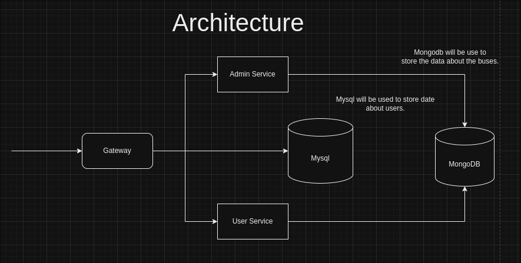

# Moveinsync Assignment


## Architecture




## Instructions

1. Start all the containers using `docker compose up` command.
2. Remove all files or folders in `./gateway/data/` , `./user/data/` and `./admin/data/`
3. Use the following command to setup the mysql database and tables.

```bash
docker exec -i mysql mysql -u root -proot < init_database.sql
```

